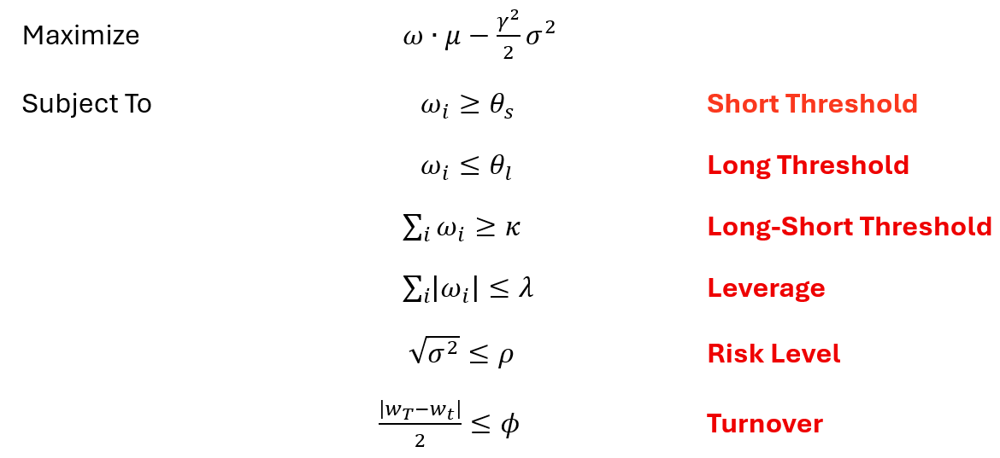
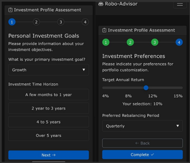
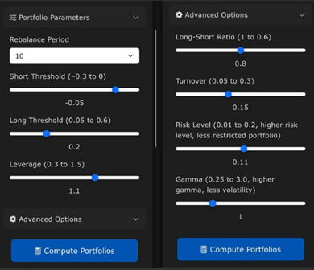
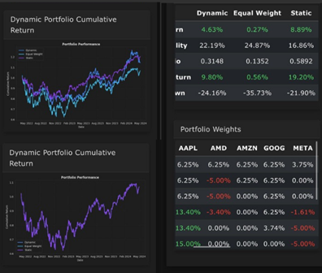

# Robo-Advisor Portfolio Optimization
This project develops a simple Robo-Advisor demo that helps users generate stock portfolios based on their risk preferences and return targets. The demo simulates a traditional utility-maximization strategy and implements a front-end tool that visualizes optimized portfolios and performance metrics.

## Introduction and Objectives
The Robo-Advisor module aims to automate personalized portfolio recommendations using conventional investment principles, such as:

- **Utility Maximization**: Simulates investor preferences using a utility function based on risk and return.
- **Mean-Variance Optimization (MVO)**: Constructs portfolios to maximize expected utility.
- **User Personalization**: Supports varying risk preferences and return targets via a web interface.

The final system demonstrates how technical parameter choices and behavioral biases can impact investment outcomes.

## Methodology
### 1. Utility-Based Portfolio Construction & Configuration
We model the investor’s objective using a utility function:

Various combinations of technical parameters are tested to simulate portfolio configurations:

Below is a scatter plot showing the top 100 performers out of 5,000 sampled portfolios, along with a comparison to the S&P 500 and an equal-weighted portfolio based on Sharpe ratio. For detailed results and analysis, please refer to the [IEDA4500 Final Report](./doc/IDEA4500-Final-Report.pdf).

### 2. User Behavior Simulation & Assessment
To bridge the gap between technical parameters and user-friendly interactions, a questionnaire was designed to derive portfolio settings from intuitive inputs. The assessment covers:

- **Personal Investment Goals**: e.g., growth strategy, time horizon.
- **Risk Tolerance**: Comfort level with market fluctuations (conservative to aggressive).
- **Financial Situation**: Saving habits, cash flow, and capital base.
- **Investment Preferences**: Target return, rebalance period, and diversification.

A parameter index table is initialized using the technical parameters. User responses are then mapped to this table to derive a set of portfolio configurations.

The detailed rules for mapping user responses to parameter indices can be found in the same document: [IEDA4500 Final Report](../../doc/IDEA4500-Final-Report.pdf).

### 3. App Demonstration
New users complete the questionnaire to initialize technical parameters:

Users may further fine-tune settings based on their investment insights:

Portfolio performance is visualized across rebalance periods:

The app was deployed via **AWS Amplify** during the in-class demo. The backend is built using **Flask** and integrated with a static front end.

## Limitations and Potential Improvements
- **Sensitivity Analysis**: More systematic evaluation of how each parameter impacts performance is needed.
- **Adaptive Tuning**: Use of heuristics or advanced optimization (e.g., evolutionary algorithms) could improve portfolio quality.
- **Data Expansion**: The current stock universe is limited. Including more assets or asset classes would improve real-world realism.

## License
This project is open-source and available under the [MIT License](LICENSE).