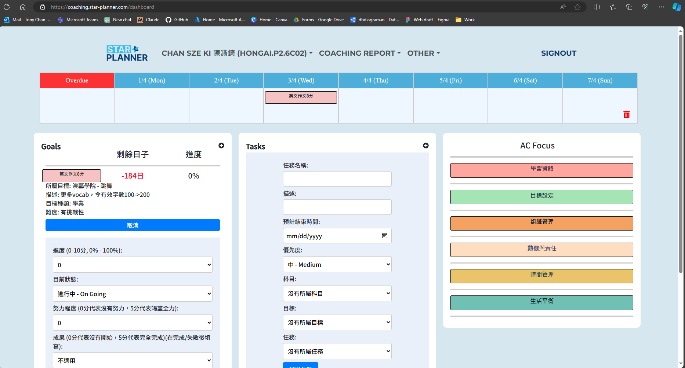
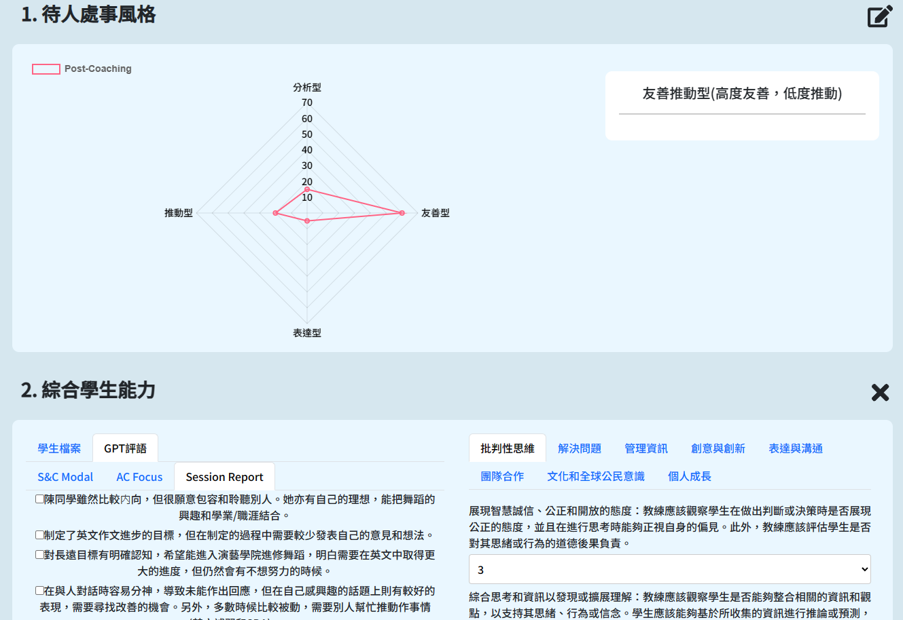
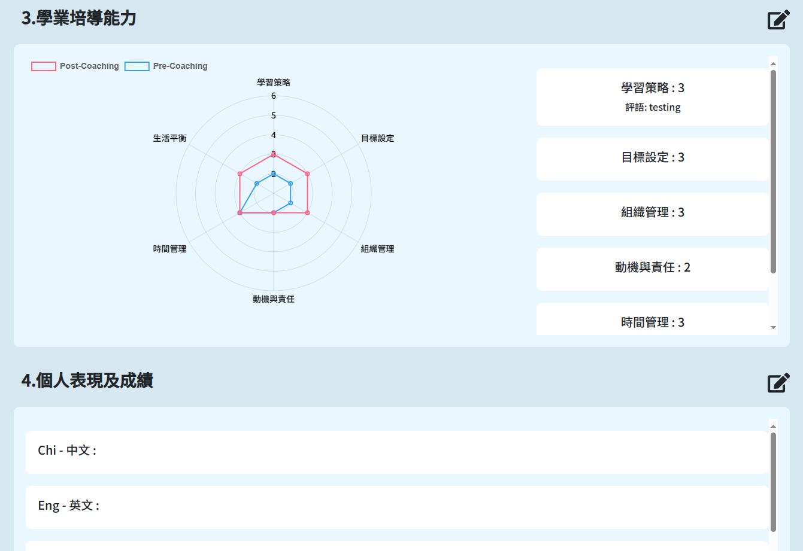
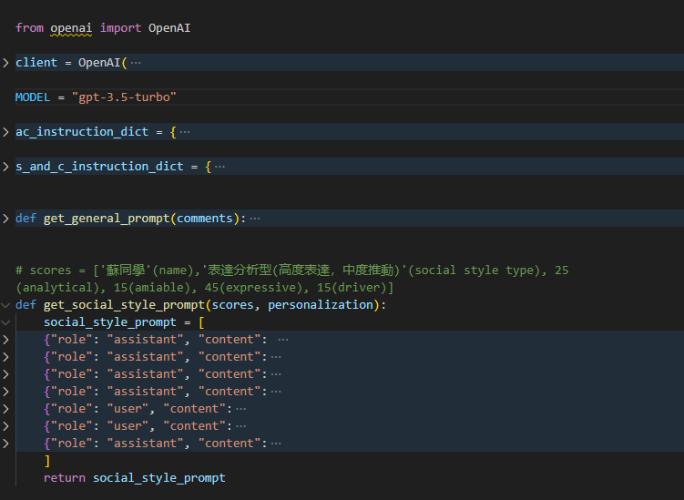

# Star Planner Coaching System

The Star Planner Coaching System is a comprehensive platform designed for Academic Coaching (AC), aimed at supporting the coaching cycle and generating insightful reports for educational stakeholders.

## Overview

The Star Planner Coaching System is a powerful tool tailored for Academic Coaching, offering essential features to enhance student engagement and academic success. With intuitive goal setting, task management, and insightful reporting capabilities, the system empowers educators and students alike to foster a culture of accountability and progress.

Official Website: [Star Planner](https://star-planner.com/)
Coaching System: [Star Planner AC Platform](https://coaching.star-planner.com/)

### Key Features:

- **Goal Setting & Evaluation**: Empower students and educators to set and assess academic goals, fostering a culture of accountability and progress tracking.
- **Task Setting & Evaluation**: Facilitate the creation and evaluation of tasks, ensuring clarity and alignment with academic objectives.
- **Mini-Timetable**: Streamline goal and task organization with intuitive drag-and-drop functionality, enhancing time management and prioritization skills.
- **Session Report Generation**: Generate insightful session reports, offering a snapshot of student progress and engagement during coaching sessions.
- **Comprehensive Reporting**: Provide stakeholders with comprehensive reports, encompassing various metrics such as Social Style, Academic Coaching Focus, and Skills & Competencies Model.

## Technology Stack

- **Frontend**: React.js
- **Backend**: Django.py
- **Database**: MySQL
- **Deployment**: Azure Web Services

## Usage

The Star Planner Coaching System is designed to seamlessly integrate into educational environments, providing a user-friendly interface for educators and students. Sign in to the system to start leveraging its powerful features for academic success.

## Screenshots

### Dashboard:

### Final Report:

### Chat GPT:

We have integrated GPT-3 for generating comments and feedback for students. Here is a sample of the code snapshot:

## Repository

Find the source code and additional information in the [Star Planner API](https://github.com/SPTonyChan/star-planner-api)
and [Star Planner FE](https://github.com/SPTonyChan/star-planner-fe) repositories.

## License

This project is proprietary and owned by Star Planner. Unauthorized use, reproduction, or distribution is strictly prohibited.