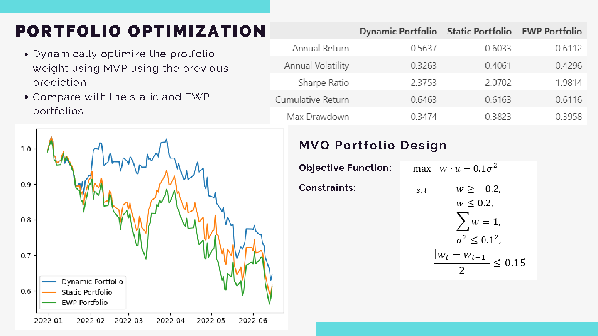
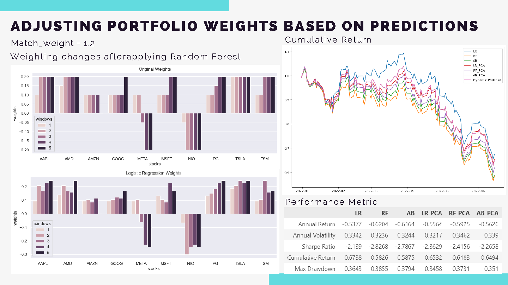
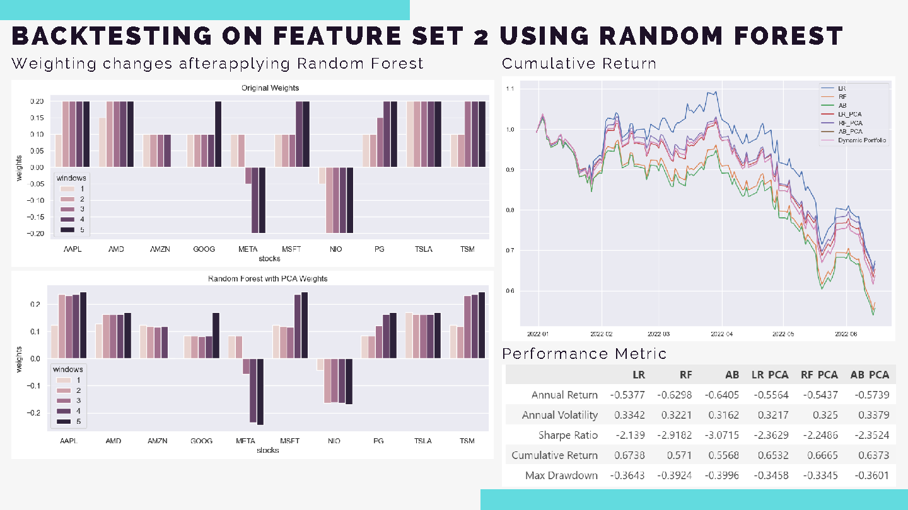
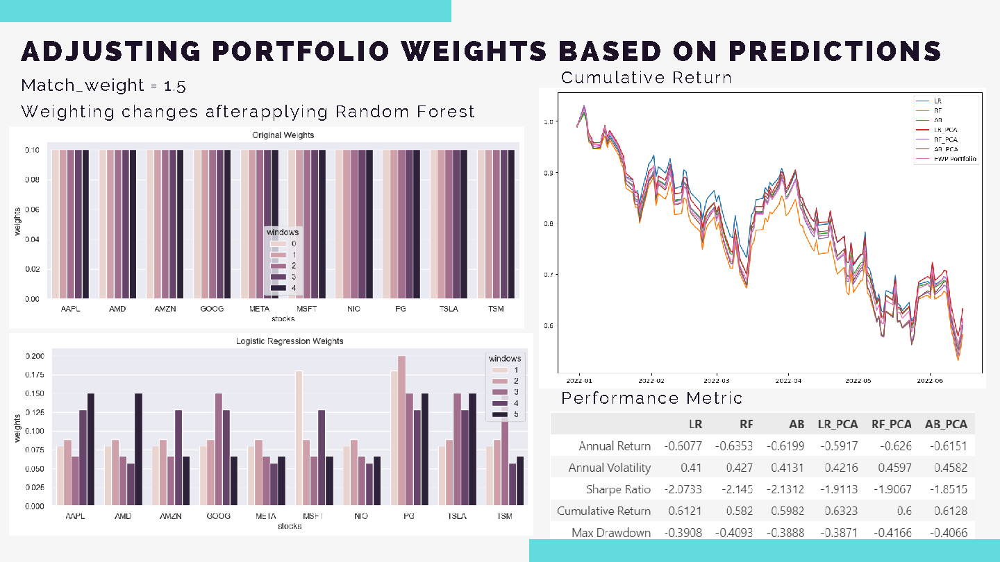

# Stock Prediction with Sentiment Analysis
This project integrates sentiment analysis with stock data for predictive modeling, aiming to enhance portfolio performance through machine learning models. The project tests various models to predict stock price movements and adjust portfolios based on these predictions.

## Introduction and Objectives
The "Stock Prediction with Sentiment Analysis" project combines sentiment analysis with stock market data to predict price movements. The primary goal is to use sentiment as a feature in machine learning models to forecast the direction of stock prices over the next rebalance window and adjust the portfolio accordingly.

- **Sentiment Analysis as a Feature**: Incorporate sentiment analysis to predict price movements.
- **Machine Learning Models**: Test different models to forecast overall stock movement during the next rebalance window.
- **Portfolio Adjustment**: Adjust portfolio weights based on predictions, focusing on True Positive and True Negative outcomes.

Sentiment analysis is used as a market indicator to provide a quantitative measure of market sentiment. This can enhance profit opportunities, particularly in short-term trading scenarios.

## Methodology
There are several key steps in the methodology of this project:
1. **Feature Processing/Selection**: Extract relevant features from stock data and sentiment scores.
2. **Model Training**: Train machine learning models to predict stock price movements. Multiple models are tested, including Logistic Regression, Random Forest, and AdaBoost (In some cases, PCA is used for dimensionality reduction and StandardScaler for normalization).
3. **Portfolio Adjustment**: Adjust portfolio weights based on model predictions.
4. **Backtesting**: Evaluate the performance of the model and portfolio over multiple rebalance windows.

### Sentiment Analysis on Stock-Related Tweets
- **Data Filtering**: Stocks with fewer than 500 tweets are filtered out.
- **Sentiment Calculation**: Sentiment scores are calculated using the `SentimentIntensityAnalyzer` from `nltk.sentiment.vader`.
- **Feature Engineering**: Two feature sets are used, incorporating stock data, sentiment scores, technical indicators, and momentum measures.

### Model Features Selection
- **Feature Set 1**: Stock Data, Sentiment Score, Log Return, Moving Average (7 and 14 days).  
- **Feature Set 2**: Feature Set 1, MACD, 14SD, Upper/Lower Band, Log Momentum.

### Portfolio Design
A Mean-Variance Optimization (MVO) portfolio is designed as the benchmark portfolio.  

### Classification
Use classification models to predict upward or downward movements in stock prices. The most frequent label within the rebalance period is selected as the final prediction.

### Portfolio Adjustment
- **Rebalance period**: 10 days.
- **Lookback period**: 50 days (for MVO portfolio).
- Backtesting is conducted over 23 windows (230 days).

### Model Selection
#### Using MVO as the Benchmark Portfolio:

  
**Logistic Regression (LR)** is selected as the best model.

#### Using PCA for Dimensionality Reduction (MVO): 

  
**Random Forest (RF)** is selected as the best model.

#### Using Equal Weights Portfolio (EWP) as the Benchmark:

## Insights and Results
- **Performance**: Certain models can slightly improve annual return and Sharpe Ratio while maintaining similar variance.
- **Prediction Accuracy**: While Logistic Regression and Random Forest may not have the highest prediction accuracy, they demonstrate strong performance metrics, suggesting other factors beyond accuracy influence results.

## Limitations and Potential Improvements
- **Sentiment Data**: The dataset from Kaggle used for sentiment analysis may be limited. Using Twitter’s API for more targeted data retrieval is recommended.
- **Machine Learning Models**: Current models like Logistic Regression and Random Forest have limitations in prediction accuracy. Exploring advanced models such as GANs may improve results.
- **Weight Adjustment**: More robust formulas to favor matching cases, and combining price prediction to optimize MVO portfolios, could be beneficial.
- **Rebalance Period**: A shorter rebalance period may be more effective, as market sentiment can influence prices over a brief period. Day-trading or 3-day trading strategies are recommended.

## License
This project is open-source and available under the [MIT License](LICENSE).
